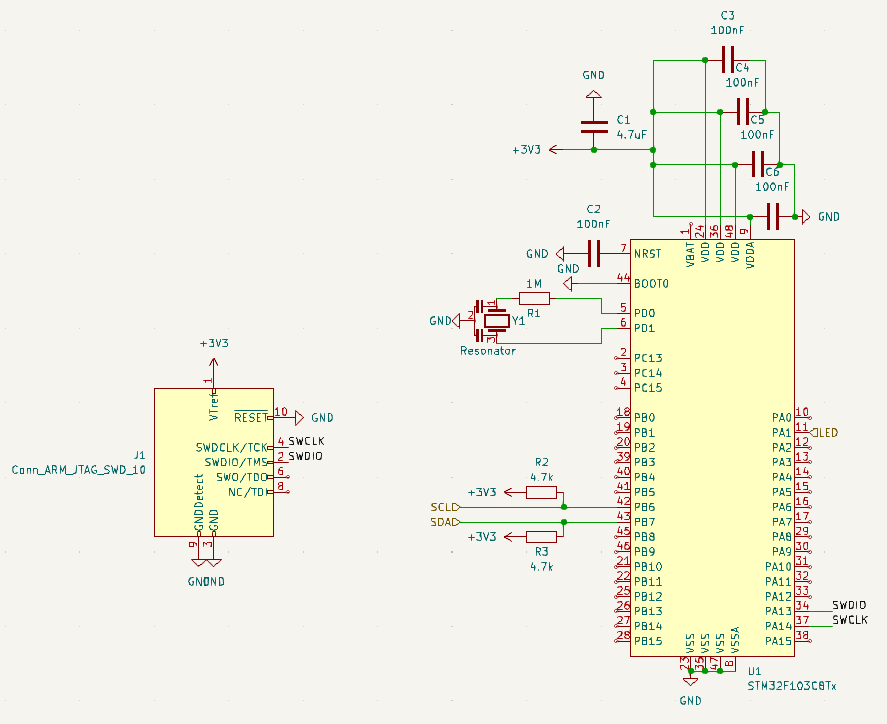
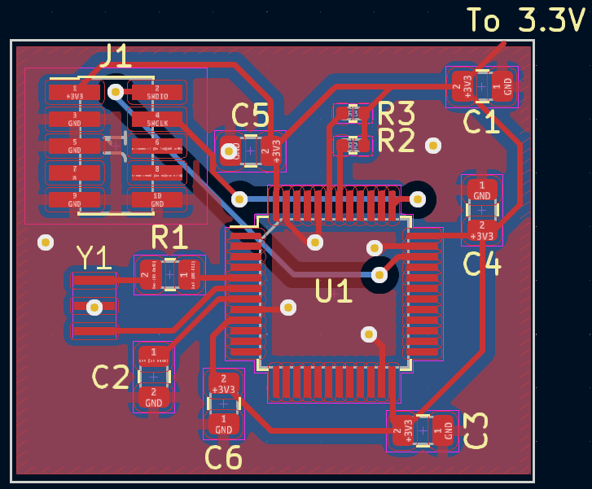

# STM32F103 Status: TESTED
This is a subcircuit which contains all of the components required for a STM32F103 to function, except for power regulation. It will require a steady 3.3v source of power. The 10 pin JTAG connector has been tested with a Segger J-Link programming cable. Allows for debugging over SWD without any additional configuration. This also provides an I2C bus, but it does not provide an SPI bus yet.

## Components:

- C1-C6: Any ceramic capacitor with the correct capacitance and a voltage rating of at least 3.3v
- J1: [10 pin JTAG Connector](https://www.digikey.com/en/products/detail/samtec-inc./FTSH-105-01-H-DV-K-P-TR/9594223)
- R1-R3: Any resistor with the correct resistance. 
- U1: [STM32F103](https://www.digikey.com/en/products/detail/stmicroelectronics/STM32F103C8T6/1646338)
- Y1: [Resonator. Linked part is 10MhZ, but 8MhZ is preferred](https://www.digikey.com/en/products/detail/murata-electronics/CSTNE10M0G550000R0/8747719)

## Considerations
- Make sure C3-C6 are placed as close to the pins they connect to as possible
- C1 isn't as important to position closely
- Resonator is optional. If you are using USB without an intermediary chip, use an 8MhZ resonator

## Recommended Routing:
