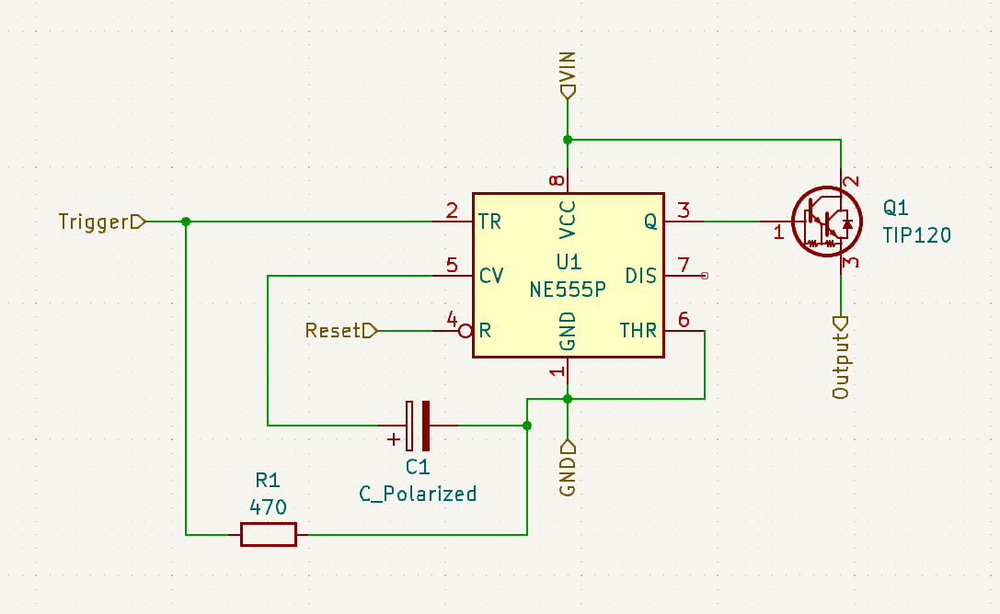

# 555IC Based Flip Flop Circuit. Status: TESTED

This circuit was designed to be used as a switch that stays on after the on signal is removed. Unlike a button it will stay on even if the on signal is sent again. Only turns off when a separate reset signal is sent (this functionality has not been tested yet).

## Components

- C1: Any polarized capacitor rated for the input voltage should work. (470 uF should work for most of our applications)
- R1: Normal 470 ohm resistor
- 555 Timer IC: Tested with NE555P
- NPN Transistor (N-channel MOSFET or BJT (such as TIP120) would work)