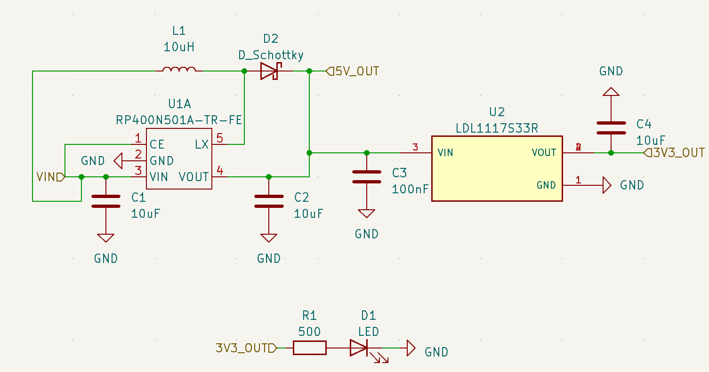
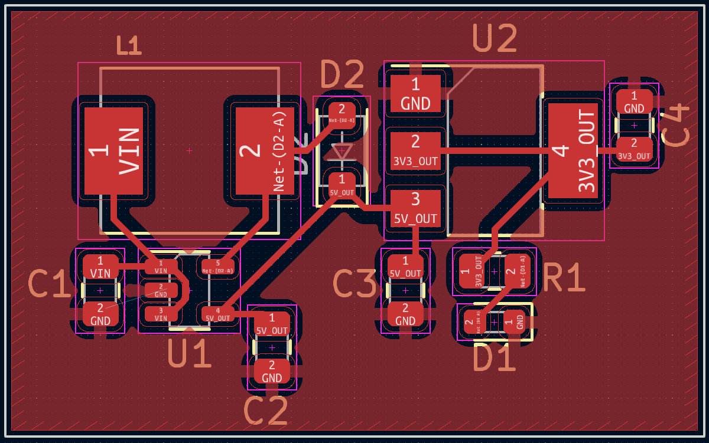

# RP400 & LDL1117 Based Power Regulation Subcircuit. 0-5V in, 3.3V & 5V out
This is a "buck" power regulation subcircuit which is able to step up voltages to output 3.3v and 5v. It contains an indicator LED to allow the user to verify the status of the 3.3v output.

## Components:

- C1-C4: Any ceramic capacitor with the correct capacitance and >= 5v will work
- D1: Any SMD led will work, but was designed for [this one](https://www.digikey.com/en/products/detail/liteon/LTST-C191KRKT/386837)
- D2: [Schottky Diode](https://www.digikey.com/en/products/detail/rohm-semiconductor/RSX101MM-30TFTR/9748173)
- L1: [10uH Inductor](https://www.digikey.com/en/products/detail/abracon-llc/ASPI-0630LR-100M-T15/3059602?s=N4IgTCBcDaIIYGcAOBLAtABgGwGYMBsAnNARgwwFsQBdAXyA)
- R1: Any resistor 500 ohms - 1k ohms
- U1: [RP400N501A](https://www.digikey.com/en/products/detail/nisshinbo-micro-devices-inc/RP400N501A-TR-FE/10244946?s=N4IgTCBcDaIE4AcAsAGFA7ArCgjAQxAF0BfIA)
- U2: [LD1117S33TR](https://www.digikey.com/en/products/detail/stmicroelectronics/LD1117S33TR/585766?s=N4IgTCBcDaIDYBMCMKDsBnAzJgLgJxAF0BfIA)

## Recommended Routing:
