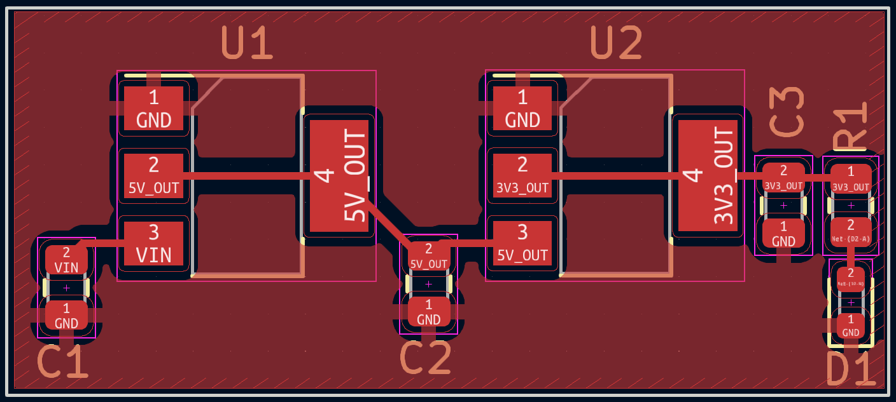

# LDL1117 Based Power Regulation Subcircuit. 5-18V in, 3.3V & 5V out. Status: UNTESTED
This is a "buck" power regulation subcircuit which is able to step down voltages to output 3.3v and 5v. It contains an indicator LED to allow the user to verify the status of the 3.3v output.

## Components:

- C1: 1uF ceramic capacitor with >= 18v rating
- C2 & C3: Any ceramic capacitor with the correct capacitance and >= 5v rating
- D1: Any SMD led will work, but was designed for [this one](https://www.digikey.com/en/products/detail/liteon/LTST-C191KRKT/386837)
- R1: Any resistor 500 ohms - 1k ohms
- U1: [LDL1117S50R (5v linear reg)](https://www.digikey.com/en/products/detail/stmicroelectronics/LDL1117S50R/7102072?s=N4IgTCBcDaIDIBE4EZUHYDKBWADAJRAF0BfIA)
- U2: [LD1117S33R (3.3v linear reg)](https://www.digikey.com/en/products/detail/stmicroelectronics/LD1117S33TR/585766?s=N4IgTCBcDaIDYBMCMKDsBnAzJgLgJxAF0BfIA)

## Recommended Routing:
