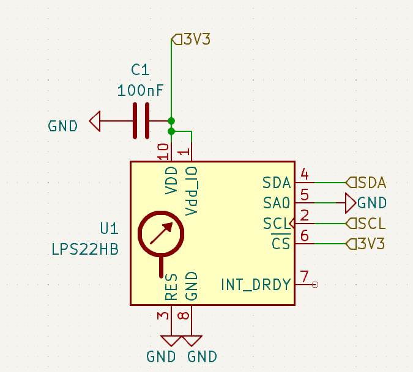
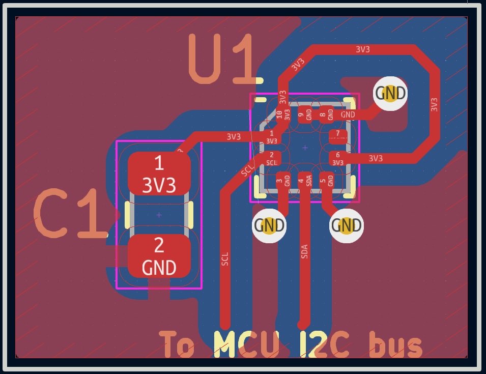

# LPS22HB Barometric Pressure Sensor. Status: TESTED
This is a minimal application circuit for the LPS22HB barometric pressure sensor. [This sensor also has a supporting library within the Multi-Mission-Flight-Software repository.](https://github.com/Terrapin-Rocket-Team/Multi-Mission-Flight-Software/tree/main/STM32F1/Sensors/LPS22HB)

## Components:

- C1: Any ceramic capacitor with the correct capacitance and >= 5v will work
- U1: [LPS22HB](https://www.digikey.com/en/products/detail/stmicroelectronics/LPS22HBTR/5799910)

## Recommended Routing:
